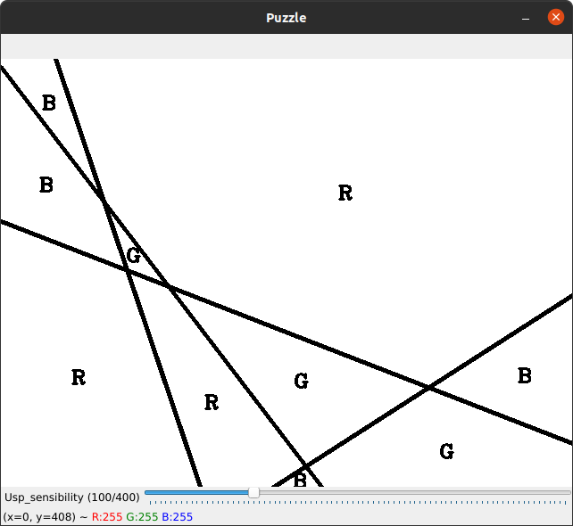

# AR Paint - Augmented Reality Paint
A program developed to the class of PSR of University of Aveiro which allows to draw with a object using a webcam by detecting the object's color.


## Description

This is a program  allows the user draw on a canvas with an object using a webcam to track it's centroid, can  display a puzzle to the user, with different levels of difficulty and give a score, can prevent against agressive shakes,can also draw shapes like squares, elipses and circles.
There's also the possibility to display the current painting on the camera window.

#### Calibration tool
The program as calibration tool( color_segmenter.py) that allows to filter the color of the webcam in order to track the object.
It will write a json file, which the main will read and identify the object by the color.
Also when starting, the script's trackbars will be set at the position of the previous calibration. If there are no prior calibrations, the script uses default values.


#### Puzzle
The gamemode puzzle generate a random pattern, that the user must fill the blank spaces with the right color, then gets an evaluation about the score points doing the puzzle.
The score points system you start with 0%, when painting the right space you gain score points, when you paint the wrong color you lose score points. If you fill the right color in the right spaces you get 100% score points.

Also the user can choose the difficulty by increasing the number of lines generated by the programm.

(como é que escolhe a dificuldade??)



#### Polygon drawing (check)

The user can draw squares, circles or elipses on the white board. To draw a square you just need to press the key 's' move the mouse to give lenght and release the key 's' end the square (?)
To draw a circle you type the key 'o' and the radius of the circle it will be the point of centroide when we press the key '0' to the position of the centroide when we release the key 'o'

#### Drawing on camera (check)

Beside the user can draw on the white board, the user can also draw on the webcam that is using to track the centroide


#### Use shake prevention
The user can call this function to prevent getting a line drawed if the object doesn't get detected then appears in a diferent far away localization. The user can use the mouse to create point and test if the function its working

```bash
main.py -j limits.json -usp 
```
# Installation

#### Requirements: 

To run the program you need this installed:
- Argparse
- OpenCv
- Numpy
- Partial from functools
- Deepcopy
- Pick
- Json
- Collections

``` bash
git clone https://github.com/brunofavs/PSR-AR-Paint.git
```

## How to run

To run the program you must open the terminal on the git that you clone, then you can type "-h" to get the information about all the comammds

```bash
main.py -h 
```
#### To start the program 

```bash
main.py -j limits.json
```
 Then choose the game mode, canvas drawing or puzzle


#### Key bindings:

###### Change pencil parameters :

- key ('r') to change to color red
- key ('g') to change to color green
- key ('b') to change to color blue
- key ('+') to increase pencil size
- key ('-') to decrease pencil size

  
###### To draw a shape :

- key ('s') to draw a square
- key ('e') to draw a elipse
- key ('o') to draw a circle

###### Other commands :

- key ('q') to quit the program
- key ('c') to clean the white_board
- key ('s') to save the draw