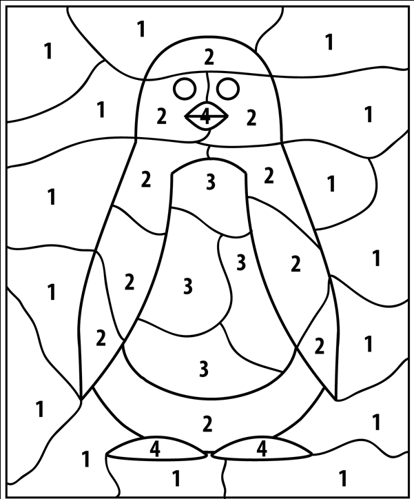
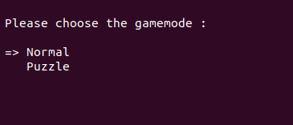

# AR Paint
A program developed to the class of PSR of University of Aveiro wich allow draw with a object using a webcam


## Description

This is a program with a bunch of aplication that allow the user draw a image with a moving an object, using a webcam to track. It can also display a puzzle to the user, with different levels of difficulty, to paint the spaces/boxes of the puzzle with the right colours. 
The program can also draw shapes like squares, elipses and circles
#### calibration tool
The program as calibration tool( color_segmenter.py) that allows to filter the color of the webcam to track better the objet.
It will right a json file, wich the main will read and identify the object by the color


#### Puzzle
The gamemode puzzle generate a random pattern, that the user must fill the blanc spaces with the right color, then it get an avaliation about the accuracy doing the puzzle.
The accuracy system you start with 0%, when painting the right space you gain accuracy, when you paint the wrong color in the space you lose accuracy. If you fill the right color in the right spaces you get 100% accuracy.


#### User shake prevention
The user can call this function to prevent getting a line draw if the object dont get detected then appear in a diferent localization. The user can use the mouse to create point and test if the function its working

```bash
main.py -usp 
```
# Installation

#### Requirements: 

To run the program you need this installed:
- argparse
- opencv
- numpy
- partial
- deepcopy

``` bash
git clone https://github.com/brunofavs/PSR-AR-Paint.git

```
## How to run

To run the program you must open the terminal on the git that you clone, then you can type "-h" to get the information about all the comammds

```bash
main.py -h 
```
#### To start the program 

```bash
main.py -j limits.json
```
#### Then choose the game mode, just draw/normal or make a puzzle


#### You can change the color of the pencil or size using:

- key ('q') to quit the program
- key ('r') to change to color red
- key ('g') to change to color green
- key ('b') to change to color blue
- key ('+') to increase pencil size
- key ('-') to decrease pencil size
- key ('c') to clean the white_board
- key ('s') to save the draw

#### To draw a shape

- key ('s') to draw a square
- key ('e') to draw a elipse
- key ('o') to draw a circle
